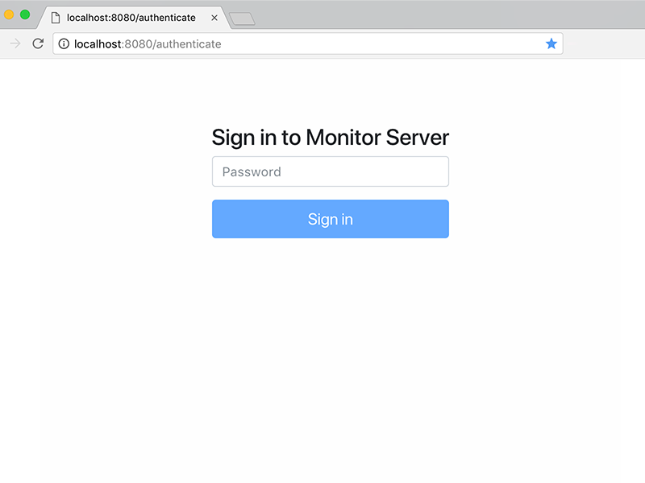
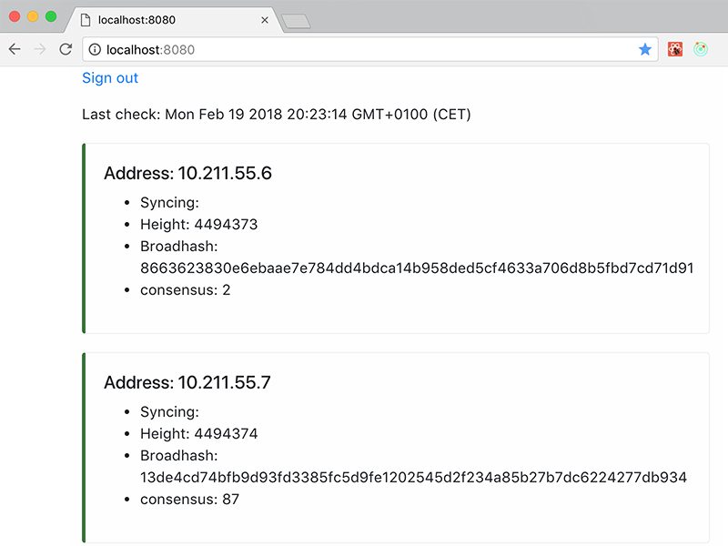

### Lisk nodes monitor

It consists of two parts, NodeJS API server which monitors delegate nodes and React frontend.

   

### How to install/use

`npm install` // to install deps  
`npm start` // to run server   
`npm run bundle` // to run client/UI   